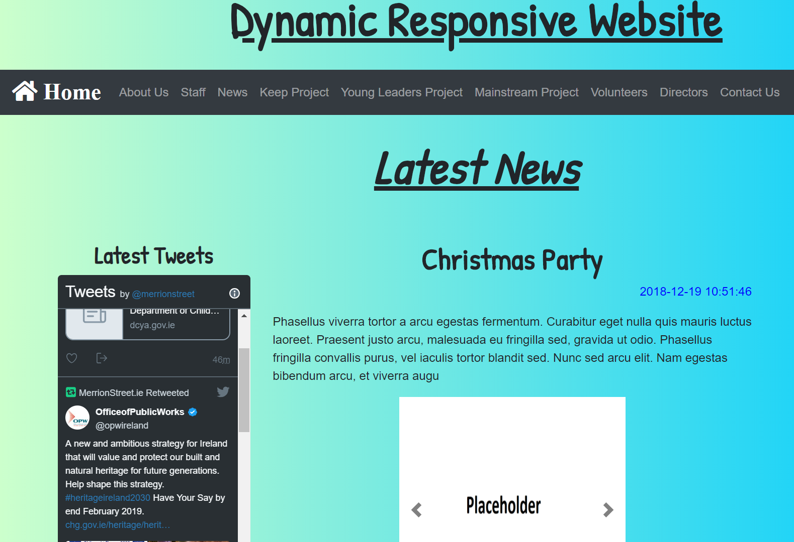
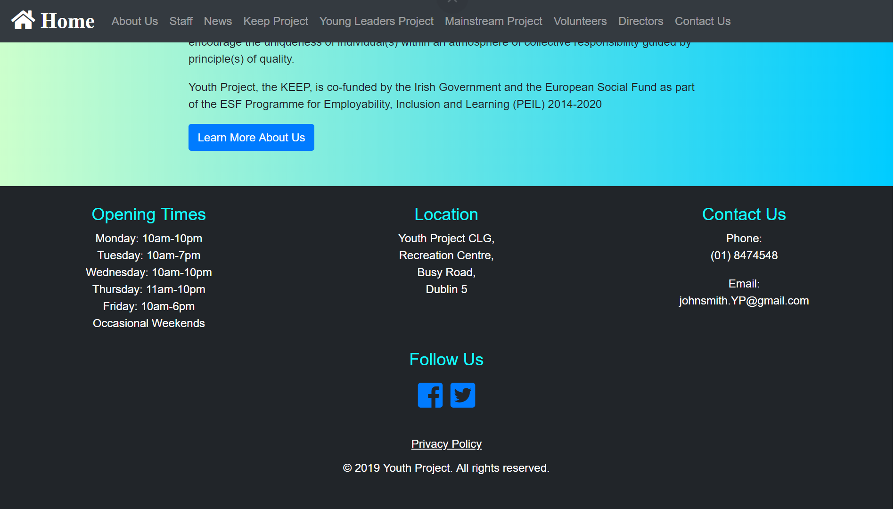
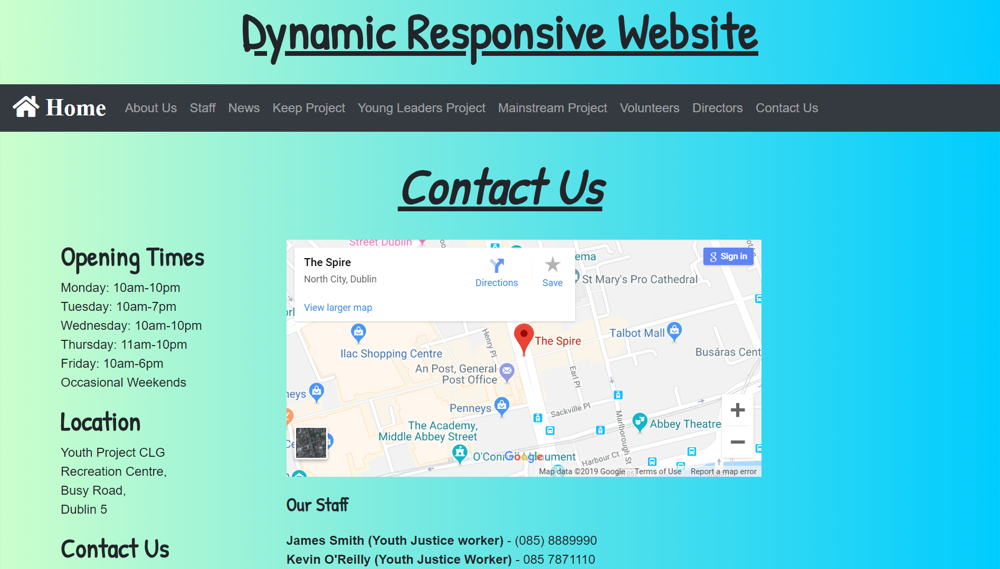

# Dynamic Responsive Website
<strong>Description:</strong> The following is a Dynamic Website that allows you easily to add/edit/delete content to the website using PHP with ease on applications such as Cpanel. It also uses Bootstrap 4 to allow for responsive and user-friendly design. It also includes Google technologies such as Google forms and Google Maps. 

<strong>Screenshot One:</strong>

  

<strong>Screenshot Two:</strong>

  

<strong>Screenshot Three:</strong>

  

